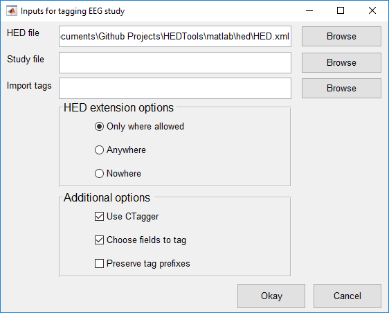

<head>

</head>

# 1. Getting Started with HEDTools

## 1.1 Overview
*HEDTools* is a MATLAB/Java Toolbox and an
EEGLAB plugin designed to help users annotate and validate events or
other data elements using a predefined, but extensible, hierarchically
structured annotation language. The input to the system consists of two
parts: a list of items to be annotated and an annotation hierarchy. In
the case of EEG, users annotate the events that occur during an EEG
study using the hierarchical event description language (HED) as the
vocabulary.

Although HEDTools can be used in very general annotation settings, the
most common application is for users to annotate the events that
occur during an EEG study using the hierarchical event description
language (HED) as the vocabulary. Many of the tools are designed to
assist in annotation of events as represented in EEGLAB *EEG.event*
structures. Once an EEG file (or study or directory) has been annotated,
users can epoch data and perform other tasks based on event annotations
rather than on laboratory specific coding schemes. This facilitates the
sharing of data and comparisons of analysis across data collections.

EEG event annotation comes in two forms: ***code-specific*** and
***event-specific***. In *code-specific* event annotation, researchers
identify a small number of event classes or categories and annotate
events by category. In EEGLAB, users typically specify this category in
the *EEG.event.type* field. EEGLAB functions such as *pop\_epoch* for
epoching data time-locked to particular event categories can facilitate
analysis. *HEDTools* support a more general form of *code-specific*
analysis than provided by EEGLAB event codes. Users can treat any of the
*EEG.event* fields as specifying a category, annotate each unique member
of the category using HED tags. *HEDTools* writes tags for the
combination of categories for each event in the *EEG.event.usertags*
field and supports very sophisticated epoching of data based on
combinations of tags.

Users can also write tag annotations that are specific to individual
events into the *EEG.event.hedtags* field of the event. Often these
annotations contain specific values for continuous parameters.
*HEDTools* does not distinguish between these event-specific annotations
and code-specific annotations in downstream analysis. This provides the
basis for analysis using very general, collection-independent event
characterization as described more fully in this manual.

## 1.2 Requirements
*HEDTools* is dependent on MATLAB. You will also need
[EEGLAB](http://sccn.ucsd.edu/eeglab/) installed if you are going to tag
or validate EEG files. Please use the most current version of EEGLAB.

## 1.3 Installation
You can run *HEDTools* as a standalone toolbox or as a plugin for
EEGLAB. In both cases, you should install EEGLAB unless you plan to use
*HEDTools* only to validate tags from spreadsheets.

### 1.3.1 Running as a standalone application
If your data files are *.mat* files, you can simply unzip the
*EEGLABPlugin/HEDTools1.0.3.zip* anywhere you choose. Execute the
*setup* script to set the paths each time you run MATLAB. Alternatively,
you can add the code contained in *setup* to your *startup* script. If
you are not using EEGLAB, you can comment out the last section of the
*setup* script.

### 1.3.2 Running with .set data file types 
If you wish to use EEGLAB, you should follow the directions above
without commenting out the last section of the setup script.

### 1.3.3 Running as a plugin to EEGLAB
To install *HEDTools* unzip the *HEDTools1.0.3.zip* file inside the
*EEGLAB plugin* directory. If you don’t install *HEDTools* via the
EEGLAB menu, you can find this file at:

<https://github.com/VisLab/HEDTools/tree/master/EEGLABPlugin>

When you start EEGLAB again, *HEDTools* should be ready to use. Note:
EEGLAB requires that each EEGLAB plugin be in its own subdirectory in
the plugins directory of EEGLAB. Thus, if you have unzipped *HEDTools*
correctly, you should see
*…/eeglab/plugins/HEDTools1.0.3*/*eegplugin\_hedtools.m*.

# 2. Annotating Data
The EEGLAB plugin version of *HEDTools* adds several additional menu
items to the EEGLAB menu associated with annotating data. These items
include: *Tag current dataset* (under the *Edit* menu), *Validate
current dataset* (under the Edit menu), *Tag study* (under the *Tag
files* submenu under the *File* menu), *Tag directory* (under the *Tag
files* submenu under the *File* menu), and *Validate files* (under the
*File* menu). If you aren’t using the plugin version or simply want to
work from the command line, you will need to call the underlying pop
functions such as *pop\_tageeg, pop\_tagdir, pop\_tagstudy*, and
*pop\_validateeeg*.

## 2.1 Tagging a single dataset
 

**Figure 1. Tagging the current dataset from the EEGLAB Edit Menu.** 

First load a dataset into the workspace by clicking the *Load existing dataset* menu
item under the *File* menu. To tag the dataset click the *Tag current
dataset* menu item under the *Edit* menu as illustrated below in Figure
1.

The *Tag current dataset* menu item executes the *pop\_tageeg* function,
which displays a menu for specifying tagging options as shown in Figure
2. (You can also bring up the menu by executing *pop\_tageeg* from the
command line. The top section of the menu allows you to browse and
select a HED file and an import file containing event tags respectively.
When browsing for an HED file only *.xml* files will be considered. When
browsing for an import file only *.mat* files will be considered. The
next section allows you to select the HED extension options. These
options include:

-   New tags can be added to HED underneath tags with the *Extension
    Allowed* attribute or leaf tags (*Only where allowed)*.

-   New tags can be added to HED underneath any tag (*Anywhere)*.

-   No new tags can be added to HED (*Nowhere)*.

The last section allows you to select additional options. These options
include:

-   Use *CTagger* to tag each selected field (*Use CTagger)*.

-   Select fields to ignore or tag through a menu (*Select fields to
    tag)*.

-   List only the tags that have the most specific tag starting with
    that prefix or list all tags that share the same prefix separately
    (*Preserve tag prefixes)*.

 

**Figure 2. pop_tageeg menu.**

Once all options are set click the *Okay* button to proceed. If the
*Select fields to tag* checkbox is checked then the following menu below
will be presented. This function then extracts and displays existing tag
information from the dataset. Usually, you will specify the class of an
event in the *EEG.event.type* field. However, you can further refine
your event annotation by giving additional subcategory fields in the
*EEG.event* structure and tag the unique values of these fields
separately. HEDTools will individual event .usertags field will contain
the tags for the combined tags from the different fields.

Depending on the options set in the *pop\_tageeg* menu you are allowed
to specify which fields to include for tagging and which fields to
ignore from tagging. This method requires that your labeling scheme be
orthogonal --- that is, it assumes each field can be tagged separately
and the tags from the fields are combined for an event.

Figure 3 shows the menu for selecting fields to tag and to ignore.
HEDTools fills in this menu with all of the fields that appear in the
EEG.events structure, allowing you to treat each field as specifying a
subclass of events. If you want to move a field over from one list to
the other click on the field and press the *Transfer* button or use the
left and right arrow buttons on the keyboard. Simply press the arrow key
that points in the direction of the list that you want to transfer the
field to. If you double click on a field then it will be set to the
*primary* field. The *primary* field is the field used to specify what
kind of event is occurring while the other fields are subfields used to
specify conditions or subcategories within the event. The *primary*
field requires a label tag (starting with /Event/Label), a category tag
(starting with /Event/Category), and a description tag (starting with
/Event/Description) for each of its unique values. By default,
*HEDTools* sets the *primary* field to *type.*

**Figure 3. Menu for choosing fields to tag.**

Once you have selected the fields to tag and pressed the *Okay* button,
*HEDTools* calls the *CTagger* tagging application (in Figure 4) for
each field in the tagging list.

**Figure 4. Tagging GUI for the type field using.**

*CTagger* is a Java application that allows you to associate tags with
each unique value of the current field. Instead of having to choose tags
at random, you select from a menu of potential tags organized in a
hierarchical format from general to more specific.

The left side of the *CTagger* display shows the unique values from the
current field and the right side contains all of the tags from the HED
hierarchy. You can use the *go back* and *done* buttons at the top left
of *CTagger* to go back to the previous field if not greyed out or to
proceed to the next field. You can use the the *undo* and *redo* buttons
which appear at the top right of *CTagger* to revert the previous
action. Zoom out and zoom in buttons appear on the upper right. The
search bar on the upper right displays possible partial matches when you
start typing in this box. When you click on one of the pull-down search
tags, the hierarchy scrolls to the position of that tag.

To select an event type value to tag, check the box next to it. As you
click on tags from the HED hierarchy on the right, they appear
underneath the value. To remove the tag, right click on the tag and
select *remove.*

You can add a vocabulary term to any leaf of the HED hierarch and at
specified other places. To add a new tag (Figure 5) to the HED
vocabulary displayed on the right, click on a leaf tag or tag with the
*Extensions Allowed* attribute and click *add tag.* From there you need
to specify the attributes of the new tag. When done click the *save*
button.

**Figure 5. Adding a new tag to the HED.**

Once the tag has been added to the HED then you will be prompted to
specify the version (Figure 6). Setting this will change the version
number that appears at the top of the CTagger. To modify the version
number again, click on the HED/\# tag and specify the value. Note: HED
uses a standard *x*.*y*.*z* versioning convention (e.g., 4.0.1). Changes
in *x* denote major releases with significant changes. Changes in *y*
denote changes that may result in minor incompatibilities with the
previous version. Changes in *z* denote minor additions, modifications
and corrections that introduce no incompatibilities. If you make your
own additions, you should version with *x*.*y*.*z*.*w* to make sure
which version of the standard hierarchy you started with.

The current HED hierarchy is maintained at
<https://github.com/BigEEGConsortium/HED/wiki/HED-Schema> in wiki
format. The *downloadhed* function downloads this wiki file from the
website. The wiki2xml function converts the wiki to XML for use in
*HEDTools*. The *updatehed* function will download the latest version,
convert to XML and save on disk for use in the tools.

**Figure 6. Specifying HED version.**

After completing the tagging, save your tagging using the *File* menu
items. *CTagger* also prompts you to save the modified HED if you have
made any modifications (Figure 7).

**Figure 7. Saving the HED.**

The first option saves the modified HED to the *HED\_USER.xml* file. The
*HED\_USER.xml* is intended for modifying the original HED (*HED.xml)*.
You should never save over or delete the *HED.xml* file. The second
option allows you to save the modified HED to any location, preferably
outside of the *HEDTools* directory. This is very useful for versioning
the HED.

**Figure 8. Saving the dataset tags.**

The *HEDTools* use *fieldMap* objects to maintain the association of
event type values with tags so that you can easily edit tags or apply
the tags to other datasets with similar events. After saving the HED you
will prompted to export the tags as *fieldMap object* (Figure 8)*.* The
first option allows you to save and specify the location of the file for
saving the *fieldMap*. You typically want to name your file something
that reflects the data that you just tagged. Your file could include the
study name or the dataset name. When you press the *Edit description*
button, *CTagger* presents a dialog for you to specify the description
of the *fieldMap* (Figure 9)*.*

**Figure 9. Specifying a fieldMap description.**

The menu above allows you to add documentation to the *fieldMap* object.
Not only is this description saved to the specified file assigned in the
previous menu, but it is written to the *EEG*.*etc.tags.description*
field of any datasets tagged by this object. After filling out the
description, press the *SAVE* button to insert the description. Then
press *Ok*. *CTagger* then presents the following dialog for saving the
dataset that you have just tagged (Figure 10).

**Figure 10. Saving a new dataset.**

You can also execute *pop\_tageeg* function from the command-line. This
function takes in one required argument, which is an EEG dataset that is
loaded into the workspace.

**Example 2.1:** Tag an *EEG* dataset with additional arguments using a
menu.

> \[EEG, fMap, com\] = pop\_tageeg(EEG);

The *EEG* return parameter is the original dataset with the tags written
to it. The *fMap* return parameter is a *fieldMap* object that contains
the field to tag association. The *com* return parameter contains the
command string containing the function call with the options selected
from the GUI. You use the *com* string to tag another dataset using the
same options.

The *pop\_tageeg* function can also be called without any user
intervention if you provide a *fieldMap* object. You will not see
*CTagger* and its associated dialogs. Instead, the function applies the
tags and saves the data. The following example illustrates how to do
this.

**Example 2.2:** Tag another dataset using a *fieldMap*.

> \[EEG1, fMap1\] = pop\_tageeg(EEG, false, 'BaseMap', fMap);

Here *false* pertains to the *UseGui* argument, which turns off user
intervention by not showing the dialogs. The *BaseMap* argument is a
*fieldMap* object or the full path to a *fieldMap* object that stores
existing event tags. To find a list of all available input arguments
refer to Table 1.

**MATLAB Syntax**

> \[EEG, fMap, com\] = pop\_tageeg(EEG)
>
> \[EEG, fMap, com\] = pop\_tageeg(EEG, UseGui, 'key1', 'value1', ...)
>
> \[EEG, fMap, com\] = pop\_tageeg(EEG, 'key1', 'value1', ...)

**Table 1. A summary of arguments for pop\_tageeg.**

**Name**|**Type**|**Description**                                                                              
EEG|Required|The EEG dataset structure that will be tagged. The dataset will need to have an .event field.
UseGui|Optional|If true (default), use a series of menus to set function arguments.
'BaseMap'|Name-Value|A *fieldMap* object or the name of a file that contains a fieldMap object to be used to initialize tag information.
'EventFieldsToIgnore'|Name-Value|A one-dimensional cell array of field names in the .event substructure to ignore during the tagging process. By default the following subfields of the .event structure are ignored: .latency, .epoch, .urevent, .hedtags, and .usertags. The user can over-ride these tags using this name-value parameter.
'FMapDescription'|Name-Value|The description of the fieldMap object. The description will show up in the .etc.tags.description field of any datasets tagged by this fieldMap.
'FMapSaveFile'|Name-Value|A string representing the file name for saving the final, consolidated fieldMap object that results from the tagging process.
'HEDExtensionsAllowed'|Name-Value|If true (default), the HED can be extended. If false, the HED cannot be extended. The 'ExtensionAnywhere' argument determines where the HED can be extended if extension are allowed.
'HEDExtensionsAnywhere'|Name-Value|If true, the HED can be extended underneath all tags. If false (default), the HED can only be extended where allowed. These are tags with the 'ExtensionAllowed' attribute or leaf tags (tags that do not have children).
'HedXML'|Name-Value|Full path to a HED XML file. The default is the HED.xml file in the hed directory.
'OverwriteUserHed'|Name-Value|If true, overwrite/create the 'HED_USER.xml' file with the HED from the fieldMap object. The 'HED_USER.xml' file is made specifically for modifying the original 'HED.xml' file. This file will be written under the 'hed' directory.
'PreserveTagPrefixes'|Name-Value|If false (default), tags for the same field value that share prefixes are combined and only the most specific is retained (e.g., /a/b/c and /a/b become just /a/b/c). If true, then all unique tags are retained.
'PrimaryEventField'|Name-Value|The name of the primary field. Only one field can be the primary field. A primary field requires a label, category, and a description tag. The default is the .type field.
'SelectEventFields'|Name-Value|If true (default), the user is presented with a GUI that allow users to select which fields to tag.
'SeparateUserHedFile'|Name-Value|The full path and file name to write the HED from the fieldMap object to. This file is meant to be stored outside of the HEDTools.
'UseCTagger'|Name-Value|If true (default), the CTagger GUI is used to edit field tags.
'WriteFMapToFile'|Name-Value|If true, write the fieldMap object to the specified 'FMapSaveFile' file.
'WriteSeparateUserHedFile'|Name-Value|If true, write the fieldMap object to the file specified by the 'SeparateUserHedFile' argument.

## 2.2 Tagging a directory of datasets

To tag a directory of datasets from EEGLAB, click the *Tag directory*
menu item under the *Tag files* menu under *File*, which is illustrated
below in Figure 5.

**Figure 11. Tagging a directory of datasets from the EEGLAB File Menu.**

The *Tag directory* menu item executes the *pop\_tagdir* function, which
brings up a menu for specifying options for tagging a directory of
datasets. The function executes without reading any datasets into
EEGLAB. The *pop­\_tagdir* function extracts tag information from all of
the datasets stored in the directory tree and uses this information to
list any existing tags. The function only considers *.set* datasets
found in the directory.

In GUI mode, the *pop\_tagdir* function first brings up a menu shown in
Figure 12. The top section of the menu allows you to browse and select a
HED file, a directory of datasets, and an import file containing event
tags. The HED file browser only displays *.xml* files. The tag import
file browser only displays *.mat* files.

**Figure 12. pop_tagdir menu.**

The second section of the pop\_tagdir menu displays options for
extending the HED vocabulary. These options include:

-   New tags can be added to the HED underneath tags with the *Extension
    Allowed* attribute or leaf tags (*Only where allowed)*.

-   New tags can be added to the HED underneath any tag (*Anywhere)*.

-   No new tags can be added to the HED (*Nowhere)*.

The last section allows you to select additional options. These options
include:

-   Search subdirectories for .set datasets (*Look in subdirectories)*.

-   Use *CTagger* to tag each selected field (*Use CTagger)*.

-   Choose fields to tag through a menu (*Choose fields to tag)*.

-   List only the tags that have the most specific tag starting with
    that prefix or list all tags that share the same prefix separately
    (*Preserve tag prefixes)*.

**Example 2.3:** Tag a directory using a series of menus.

> \[fMap, fPaths, com\] = pop\_tagdir();

The *fMap* return argument is a *fieldMap* object that contains all of
the tags associated with each unique field value. The *fPaths* return
argument is a cell array containing the full path names of the datasets
tagged during this call. You use the *com* string to tag another
directory using the same options.

The *pop\_tag\_dir* function follows a very similar workflow to the
*pop\_tageeg* function*.* By default, *pop\_tagdir* displays a menu,
similar to the one of Figure 3, allowing you to decide which fields to
tag or ignore. Once you have picked the fields to tag, the *pop\_tagdir*
function displays *CTagger* (see Figure 4) for each selected field. If
you modify the HED hierarchy, *CTagger* prompts you to save the HED to a
file (Figure 5). From there you will prompted to save a *fieldMap*
object (Figure 8 and Figure 9). The final step of saving the tagged data
uses the dialog of Figure 13. The first option allows you to overwrite
the datasets from the directory to include the HED tags. The second
option allows you to copy the datasets to a separate directory and then
tag them. When finished press the *Ok* button.

**Figure 13. Save multiple datasets.**

**MATLAB Syntax**

> \[fMap, fPaths, com\] = pop\_tagdir()
>
> \[fMap, fPaths, com\] = pop\_tagdir(UseGui, 'key1', 'value1', ...)
>
> \[fMap, fPaths, com\] = pop\_tagdir('key1', 'value1', ...)

**Table 2. A summary of arguments for pop\_tagdir.**

**Name**|**Type**|**Description**
UseGui|Optional|If true (default), use a series of menus to set function arguments.
'BaseMap'|Name-Value|A *fieldMap* object or the name of a file that contains a *fieldMap* object to be used to initialize tag information.
'CopyDatasets'|Name-Value|If true, copy the datasets to the 'CopyDestination' directory and write the HED tags to them.
'CopyDestination'|Name-Value|The full path of a directory to copy the original datasets to and write the HED tags to them.
'DoSubDirs'|Name-Value|If true (default), the entire inDir directory tree is searched. If false, only the inDir directory is searched.
'EventFieldsToIgnore'|Name-Value|A one-dimensional cell array of field names in the *.event* substructure to ignore during the tagging process. By default the following subfields of the .event structure are ignored: *.latency*, *.epoch*, *.urevent*, *.hedtags*, and *.usertags*. The user can over-ride these tags using this name-value parameter.
'FMapDescription'|Name-Value|The description of the *fieldMap* object. The description will show up in the .etc.tags.description field of any datasets tagged by this *fieldMap*.
'FMapSaveFile'|Name-Value|A string representing the file name for saving the final, consolidated *fieldMap* object that results from the tagging process.
'HEDExtensionsAllowed'|Name-Value|If true (default), HED can be extended. If false, HED cannot be extended. The 'ExtensionAnywhere' argument determines where HED can be extended if extension are allowed.
'HEDExtensionsAnywhere'|Name-Value|If true, the HED can be extended underneath all tags. If false (default), the HED can only be extended where allowed: tags with 'ExtensionAllowed' attribute or leaf tags (tags that do not have children).
'HedXML'|Name-Value|Full path to a HED XML file. The default is the HED.xml file in the *hed* directory of *HEDTools*.
'InDir'|Name-Value|A directory that contains similar EEG .set files.
'OverwriteDatasets'|Name-Value|If true, write the the HED tags to the original datasets.
'OverwriteUserHed'|Name-Value|If true, overwrite/create the 'HED_USER.xml' file with the HED from the fieldMap object. The 'HED_USER.xml' file is made specifically for modifying the original 'HED.xml' file. This file will be written under the 'hed' directory.
'PreserveTagPrefixes'|Name-Value|If false (default), tags for the same field value that share prefixes are combined and only the most specific is retained (e.g., /a/b/c and /a/b become just /a/b/c). If true, then all unique tags are retained.
'PrimaryEventField'|Name-Value|The name of the primary field. Only one field can be the primary field. A primary field requires a label, category, and a description tag. The default is the .type field.
'SelectEventFields'|Name-Value|If true (default), the user is presented with a GUI that allow users to select which fields to tag.
'SeparateUserHedFile'|Name-Value|The full path and file name to write the HED from the fieldMap object to. This file is meant to be stored outside of the HEDTools.
'UseCTagger'|Name-Value|If true (default), the *CTagger* GUI is used to edit field tags.
'WriteFMapToFile'|Name-Value|If true, write the fieldMap object to the specified 'FMapSaveFile' file.
'WriteSeparateUserHedFile'|Name-Value|If true, write the fieldMap object to the file specified by the 'SeparateUserHedFile' argument.

2.3 Tagging an EEGLAB study
---------------------------

To tag a directory of datasets click the *Tag study* menu item under the
*Tag files* menu under *File* as illustrated below in Figure 14.

**Figure 14. Tagging a study and its associated datasets from the EEGLAB File Menu.**

The *Tag study* menu item executes the *pop\_tagstudy* function, which
brings up a menu for specifying options for tagging a study and its
associated datasets. The function executes without reading any datasets
into EEGLAB. The *pop­\_tagstudy* function extracts tag information from
the study and uses this information to list any existing tags.

Figure 15 shows the option menu that appears when you call
*pop\_tagstudy* as a GUI. The top section of the menu allows you to
browse and select a HED file, a study file, and an import file
containing event tags. The browser to select a HED file only shows
*.xml* files, the browser to select study files only shows *.study*
files, and the browser for importing tags only shows *.mat* files will
be considered.

**Figure 15. pop_tagstudy menu.**

The middle section of the menu provides options for modifying the HED
vocabulary:

-   New tags can be added to the HED underneath tags with the *Extension
    Allowed* attribute or leaf tags (*Only where allowed)*.

-   New tags can be added to the HED underneath any tag (*Anywhere)*.

-   No new tags can be added to the HED (*Nowhere)*.

The last section allows you to select additional options. These options
include:

-   Use *CTagger* to tag each selected field (*Use CTagger)*.

-   Choose fields to tag through a menu (*Choose fields to tag)*.

    List only the tags that have the most specific tag starting with
    that prefix or list all tags that share the same prefix separately
    (*Preserve tag prefixes)*.

**Example 2.4:** Tag a study and its associated datasets using a series
of menus.

> \[fMap, fPaths, com\] = pop\_tagstudy();

The *fMap* return argument is a *fieldMap* object that contains all of
the tags associated with each unique field value. The *fPaths* return
argument is a cell array containing the full path names of the datasets
tagged during this call. You use the *com* string to tag another study
using the same options.

The *pop\_tag\_study* function follows a very similar workflow to the
*pop\_tageeg* function*.* By default, *pop\_tagstudy* displays a menu,
similar to the one of Figure 3, allowing you to decide which fields to
tag or ignore. Once you have picked the fields to tag, the *pop\_tagdir*
function displays *CTagger* (see Figure 4) for each selected field. If
you modify HED then it will prompt you to save HED to a file (Figure 7).
From there you will prompted to save a *fieldMap* object. Finally, you
will be prompted on how you would like to save the tagged data.

**MATLAB Syntax**

> \[fMap, fPaths, com\] = pop\_tagstudy()
>
> \[fMap, fPaths, com\] = pop\_tagstudy(UseGui, 'key1', 'value1', ...)
>
> \[fMap, fPaths, com\] = pop\_tagstudy('key1', 'value1', ...)

**Table 3. A summary of arguments for pop\_tagstudy.**

**Name**|**Type**|**Description**
UseGui|Optional|If true (default), use a series of menus to set function arguments.
'BaseMap'|Name-Value|A *fieldMap* object or the name of a file that contains a *fieldMap* object to be used to initialize tag information.
'CopyDatasets'|Name-Value|If true, copy the datasets to the 'CopyDestination' directory and write the HED tags to them.
'CopyDestination'|Name-Value|The full path of a directory to copy the original datasets to and write the HED tags to them.
'EventFieldsToIgnore'|Name-Value|A one-dimensional cell array of field names in the .event substructure to ignore during the tagging process. By default, the following subfields of the *EEG.event* structure are ignored: *.latency*, *.epoch*, *.urevent*, *.hedtags*, and *.usertags*. The user can override these tags using this name-value parameter.
'FMapDescription'|Name-Value|The description of the *fieldMap* object. The description will show up in the .etc.tags.description field of any datasets tagged by this *fieldMap*.
'FMapSaveFile'|Name-Value|A string representing the file name for saving the final, consolidated *fieldMap* object that results from the tagging process.
'HEDExtensionsAllowed'|Name-Value|If true (default), HED can be extended. If false, HED cannot be extended. The 'ExtensionAnywhere' argument determines whether HED can be extended if extension are allowed.
'HEDExtensionsAnywhere'|Name-Value|If true, HED can be extended underneath all tags. If false (default), HED can only be extended where allowed. These are tags with the 'ExtensionAllowed' attribute or leaf tags (tags that do not have children).
'HedXML'|Name-Value|Full path to a HED XML file. The default is the *HED.xml* file in the *HEDTools* *hed* directory.
'OverwriteDatasets'|Name-Value|If true, write the the HED tags to the original datasets.
'OverwriteUserHed'|Name-Value|If true, overwrite/create the 'HED_USER.xml' file with the HED from the fieldMap object. The 'HED_USER.xml' file is made specifically for modifying the original 'HED.xml' file. This file will be written under the 'hed' directory.
'PreserveTagPrefixes'|Name-Value|If false (default), tags for the same field value that share prefixes are combined and only the most specific is retained (e.g., /a/b/c and /a/b become just /a/b/c). If true, then all unique tags are retained.
'PrimaryEventField'|Name-Value|The name of the primary field. Only one field can be the primary field. A primary field requires a label, category, and a description tag. The default is the *.type* field.
'SelectEventFields'|Name-Value|If true (default), the user is presented with a GUI that allow users to select which fields to tag.
'SeparateUserHedFile'|Name-Value|The full path and file name to write the HED from the fieldMap object to. This file is meant to be stored outside of the HEDTools.
'StudyFile'|Name-Value|The path to an EEG study.
'UseCTagger'|Name-Value|If true (default), the *CTagger* GUI is used to edit field tags.
'WriteFMapToFile'|Name-Value|If true, write the fieldMap object to the specified 'FMapSaveFile' file.
'WriteSeparateUserHedFile'|Name-Value|If true, write the fieldMap object to the file specified by the 'SeparateUserHedFile' argument.

# 3. Validating Data
If you are using the plugin version, *HEDTools* adds three menu items to
the EEGLAB menu associated with validating annotated data: *Validate
current EEG* (from the *Edit* menu), *Validate study* (from the
*Validate files* submenu under the *File* menu), or *Validate directory*
(from the *Validate files* submenu under the *File* menu). You can also
validate directly from the command line as explained below.

## 3.1 What the validation checks for
Aside from checking if the event tags are present in HED, the validation
functions also checks for and generate errors for the following issues:

-   Tags with the **isNumeric** attribute must have a numerical value.
    Some tags that are numerical have units associated with them that
    can be specified. If not, the default units will be assigned to them
    as determined by the **unit class** attribute. A **unit class**
    contains a collection of units of the same unit dimension (e.g.,
    length, time, angle, etc.). When units are specified for a numerical
    tag the validator verifies that the units belong to the correct unit
    class for a particular tag.

-   Tags with the **required** attribute must for present in each and
    every event. These currently are tags that start with the prefixes
    */Event/Category*, */Event/Description* and */Event/Label*.

-   Tags with the **requireChild** attribute cannot be present in any
    event. Instead a descendant of these tags will have to be in its
    place. For example, the tag *Event/Category* cannot be present in an
    event. However, *Event/Category/Participant response* can because it
    is a descendant of *Event/Category* and doesn’t have the
    **requireChild** attribute.

-   Tags with the **unique** attribute can only have one descendant tag
    present in an event. For example, there cannot be two tags start
    with the prefix /Event/Label because this tag has the **unique**
    attribute.

-   Tags in groups can have no more than 2 tildes. For example,
    *(/Participant \~ /Action/Type/Allow/Access \~
    /Item/Object/Person/ID Holder)* is a valid group containing tildes.

In addition to this, the validation generates warning for the following syntax issues:

-   Numerical tags that have a unit class should have units specified.
    For example, */Attribute/Visual/Luminance/444* is discouraged and
    should have units specified: */Attribute/Visual/Luminance/444
    candela*.

<!-- -->

-   The first word in each tag should be capitalized and all subsequent
    words should be lowercase. This doesn’t apply to tags that take a
    value. For example, */Event/Category/Experimental Stimulus* is
    discouraged. The Stimulus part should be lowercase.

Any event tags that do not comply with these rules will be written to a
log file. The log file by default will only contain errors. To include
warnings in the file you will need to specify the option. A typical log
file appears as follows:

> Issues in event 28:
>
> Invalid HED tag - "Action/Type/Button press/Keyboard in group
> ((Participant \~ Action/Type/Button press/Keyboard \~
> Participant/Effect/Body part/Arm/Hand/Finger))"

The snippet above contains the event in which the issue occurred, the
type of issue, and the tag that generated the issue.

## 3.2 Validating a single dataset
To validate tags of a single dataset, you should load the dataset into
the MATLAB workspace. If working through the EEGLAB menu, should load
the dataset into EEGLAB by clicking the *Load existing dataset* menu
item under the *File* menu. To validate the dataset click the *Validate
current dataset* menu item under the *Edit* menu as illustrated below in
Figure 16.

**Figure 16. Validating the current dataset from the EEGLAB Edit Menu.**

The *Validate current dataset* menu item executes the *pop\_validateeeg*
function which brings up a menu for specifying options for validation.

**Figure 17. pop\_validateeeg menu.**

The top section of the *pop\_validateeeg* allows you to browse for a HED
file and to set an output directory. The next section allows you to
indicate whether or not you want to include warnings in the log file:

-   Include warnings in addition to errors in the log file (*Include
    warnings in log file)*

Once all options are set, click the *Okay* button to proceed.

**Example 3.1:** Validate the HED tags in a dataset, the workspace with
a list of issues, and output a log file under the current directory.

> \[issues, com\] = pop\_validateeeg(EEG);

The *issues* return argument is a one-dimensional cell array containing
the output from the validation. Each cell corresponds to a particular
event that raised an issue. You can use the *com* string to validate
another dataset using the same options.

When working exclusively from the command line, you should set the
second argument of the *pop\_validateeeg* function to *false*. This
bypasses the menus for setting the function arguments.

**Example 3.2:** Validate the HED tags in a dataset and write the output
to the workspace and a log file under the current directory without
using a menu.

> \[issues, com\] = pop\_validateeeg(EEG, false);

**MATLAB Syntax**

> \[issues, com\] = pop\_validateeeg(EEG)
>
> \[issues, com\] = pop\_validateeeg(EEG, UseGui, 'key1', 'value1', ...)
>
> \[issues, com\] = pop\_validateeeg(EEG, 'key1', 'value1', ...)

**Table 4. A summary of arguments for pop\_validateeeg.**

**Name**|**Type**|**Description**
EEG|Required|The EEG dataset structure containing HED tags in the *EEG.event* structure. The tags need to be present in the *.usertags* and/or *.hedtags* fields of *EEG.event*.
UseGui|Optional|If true (default), use a series of menus to set function arguments.
'GenerateWarnings'|Name-Value|If true, include warnings in the log file in addition to errors. If false (default), only include errors in the log file.
'HedXml'|Name-Value|The full path to a HED XML file containing all of the tags. This by default will be the *HED.xml* file found in the *hed* directory of *HEDTools*.
'OutputFileDirectory'|Name-Value|The directory where the validation output is written.
'WriteOutputToFile'|Name-Value|If true (default), write the validation issues to a log file in addition to the workspace. If false, only write the issues to the workspace.

## 3.3 Validating a directory of datasets

To validate a directory of datasets click the *Validate directory* menu
item under the *File* menu as illustrated in Figure 18.

**Figure 18. Validate a directory of datasets from the EEGLAB File Menu.**

The *Validate directory* menu item executes the *pop\_validatedir*
function, which brings up a menu for specifying options for validation.

**Figure 19. pop_validatedir menu.**

The top section of the *pop\_validatedir* menu allows you to browse and
select a root directory where the datasets are located, a HED file, and
an output directory. The next section allows you to set additional
options including:

-   Search in the subdirectories for datasets (*Look in subdirectories)*

-   Include warnings in addition to errors in the log file (*Include
    warnings in log file)*

Click the Okay button to proceed to validation.

**Example 3.3:** Validate the HED tags in a directory of datasets and
write the log file to the current directory using a menu.

> \[fPaths, com\] = pop\_validatedir();

The *fPaths* return argument is a cell array containing the full path
names of the datasets tagged during this call. You can use the *com*
string to validate another directory using the same options without the
menu.

When working exclusively from the command line, you want to set the
second argument of the *pop\_validatedir* function to *false*. This
bypasses the menu for setting the function arguments.

**Example 3.4:** Validate the HED tags of the datasets in the current
directory and write the log file to the current directory without using
a menu.

> fPaths = pop\_validatedir(false);

**MATLAB Syntax**

> \[fPaths, com\] = pop\_validatedir()
>
> \[fPaths, com\] = pop\_validatedir(UseGui, 'key1', 'value1', ...)
>
> \[fPaths, com\] = pop\_validatedir('key1', 'value1', ...)

**Table 5. A summary of arguments for pop\_validatedir.**

**Name**|**Type**|**Description**
UseGui|Optional|If true (default), use a series of menus to set function arguments.
'DoSubDirs'|Name-Value|If true (default), the entire *inDir* directory tree is searched. If false, only the *inDir* top-level directory is searched.
'GenerateWarnings'|Name-Value|If true, include warnings in the log file in addition to errors. If false (default), only include errors in the log file.
'HedXml'|Name-Value|The full path to a HED XML file containing all of the tags. This by default will be the *HED.xml* file found in the *hed* subdirectory of the *HEDTools*.
'InDir'|Name-Value|A directory containing tagged EEG datasets to be validated.
'OutputFileDirectory'|Name-Value|The directory where the validation output is written. There will be a log file generated for each study dataset validated.

## 3.4 Validating an EEGLAB study

To validate an EEGLAB study from the EEGLAB menu, click the *Validate
current dataset* menu item under the *File* menu as illustrated in
Figure 20.

**Figure 20. Validate an EEGLAB study from the EEGLAB File Menu.**

The *Validate study* menu item executes the *pop\_valideatestudy*
function, which brings up a menu for specifying options for validation
as shown in Figure 21.

**Figure 21. pop_validatestudy menu.**

The top section of the *pop\_validatestudy* menu allows you to browse
and to select a study file, a HED file, and an output directory. The
next section allows you to include warnings in addition to errors in the
log file (*Include warnings in log file)*. Click the *Okay* button to
proceed.

**Example 3.5:** Validate a study using a menu.

> \[fPaths, com\] = pop\_validatestudy();

The *fPaths* return argument is a cell array containing the full path
names of the datasets tagged during this call. You can use the *com*
string to validate another study using the same options without the
menu.

**MATLAB Syntax**

> \[fPaths, com\] = pop\_validatestudy()
>
> \[fPaths, com\] = pop\_validatestudy(UseGui, 'key1', 'value1', ...)
>
> \[fPaths, com\] = pop\_validatestudy('key1', 'value1', ...)

**Table 6. A summary of arguments for pop\_validatestudy.**

**Name**|**Type**|**Description**
UseGui|Optional|If true (default), use a series of menus to set function arguments.
'GenerateWarnings'|Name-Value|If true, include warnings in the log file in addition to errors. If false (default), only include errors in the log file.
'HedXml'|Name-Value|The full path to a HED XML file containing all of the tags. This by default will be the *HED.xml* file found in the *hed* subdirectory of *HEDTools*.
'OutputFileDirectory'|Name-Value|The directory where the validation output is written to. Validation generates a log file for each study dataset validated.
'StudyFile'|Name-Value|The full path to an EEG study file. This must be provided if UseGui is false.

# 4. Extracting data epochs by HED tags
The EEGLAB *pop\_epoch* function extracts data epochs that are time
locked to specified event types. This function allows you to epoch on
one of a specified list of event types as defined by the
*EEG.event.type* field of the EEG structure. *HEDTools* provide a simple
way for extracting data epochs from annotated datasets using a much
richer set of conditions. To use HED epoching, you must have annotated
the EEG dataset with HED tags stored in the *.usertags* and *.hedtags*
fields under the *EEG.event* field of the EEG dataset. If the dataset is
not tagged, please refer to section 2.1 on how to tag a dataset.

To extract data epochs by HED tags through the EEGLAB menu, first load a
dataset into the workspace by clicking the *Load existing dataset* menu
item under the *File* menu. From there click the *Extract epochs by
tags* menu item under the *Tools* menu as illustrated in Figure 22.

**Figure 22. Extracting data epochs by tags from the EEGLAB Edit Menu.**

The *Extract epochs by tags* menu item executes the *pop\_epochhed*
function, which brings up a menu for specifying options for extracting
data epochs as shown in Figure 23.

**Figure 23. pop_epochhed menu.**

The *pop\_epochhed* menu is almost
identical to the EEGLAB *pop\_epoch* menu with the exception of the
first input field (*Time-locking HED tag(s)*). Instead of passing in or
selecting from a group of unique event types the user passes in a comma
separated list of HED tags or a Boolean search string explained in the
next section. Clicking the adjacent button (with the label …) will open
a new menu used for inputting HED tags as shown below in Figure 24.

**Figure 24. pop\_epochhed search bar.**

The advanced tag search uses Boolean operators (AND, OR, AND NOT) to widen
or narrow the search. Two tags separated by a comma use the AND operator
by default, meaning that it will only return events that contain both
the tags. The OR operator looks for events that include either one or
both tags being specified. The AND NOT operator looks for events that
contain the first tag but not the second tag. To nest or organize the
search statements use square brackets. Nesting changes the order of
evaluation of the search statements. For example,
"/Attribute/Visual/Color/Green AND \[/Item/2d shape/Rectangle/Square OR
/Item/2d shape/Ellipse/Circle\]" searchers for events that have a green
square or a green circle.

When you type something in the search bar, the dialog displays a list
below containing possible matches. Pressing the "up" and "down" arrows
on the keyboard while the cursor is in the search bar moves to the next
or previous tag in the list. Pressing "Enter" selects the current tag in
the list and adds the tag to the search bar. When done, click the "Ok"
button to return to the main epoching menu.

**MATLAB Syntax**

> \[EEG, indices, com\] = pop\_epochhed(EEG)
>
> \[EEG, indices, com\] = pop\_epochhed(EEG, tagstring, timelimits)
>
> \[EEG, indices, com\] = pop\_epochhed(EEG, tagstring, timelimits,
'key1', value1 ...)
  
**Table 7. A summary of arguments for pop\_epochhed.**

**Name**|**Type**|**Description**
EEG|Required|Input dataset. Data may already be epoched; in this case, extract (shorter) subepochs time locked to epoch events.
tagstring|Required if no GUI|A search string consisting of tags to use for extracting data epochs. The tag search uses the Boolean operators (AND, OR, AND NOT) to widen or narrow the search. Two tags separated by a comma use the AND operator by default, and the search only returns events that contain both of the tags. The OR operator looks for events that include either one or both tags being specified. The AND NOT operator looks for events that contain the first tag but not the second tag. To nest or organize the search statements use square brackets. Nesting will change the order in which the search statements are evaluated. For example, "/Attribute/Visual/Color/Green AND \[/Item/2d shape/Rectangle/Square OR /Item/2d shape/Ellipse/Circle\]" find events with green squares or circles.
timelimits|Required if no GUI|Epoch latency limits \[start end\] in seconds relative to the time-locking event {default: \[-1 2\]}
'epochinfo'|Name-Value|Propagate event information into the new epoch structure {default: 'yes'}.
'eventindices'|Name-Value|Extract data epochs time locked to the specified event numbers (either an integer or a vector of integers.
'newname'|Name-Value|New dataset name {default: "\[old\_dataset\] epochs"}
'timeunit'|Name-Value|Time units (either 'seconds' or 'points'). If 'seconds', event latencies are in seconds. If 'points', event latencies are in frames. The default is 'points'.
'valuelim'|Name-Value|Lower and upper bound latencies for trial data relative to the time-locked event, given as \[min max\] or \[max\]. If one positive value is given, use its negative as the lower bound. The given values are also considered outliers (min max) {default: none}
'verbose'|Name-Value|\['yes' or 'no'\] {default: 'yes'}

# 5. Data Formats
*HEDTools* is structured and hence requires two items: a tag hierarchy
and a map of field values. The tag hierarchy is in XML format and
*HEDTools* provides a schema for validation. The association of tags and
types of events is represented by a *fieldMap.*

## 5.1 XML tag hierarchy (HED)
*HEDTools* assume that rather than inventing tags at random, you will
have a vocabulary of suggested tags presented in hierarchical form as
shown on the right in Figure 4. Internally, this hierarchy is
represented as an XML string.

**Example 5.1:** A snippet from the HED.

> &lt;?xml version="1.0" encoding="utf-8"?&gt;
>
> &lt;HED version="4.0.1"&gt;
>
> &lt;node&gt;
>
> &lt;name&gt;Event&lt;/name&gt;
>
> &lt;node position="1" predicateType="passThrough" requireChild="true"
> required="true"&gt;
>
> &lt;name&gt;Category&lt;/name&gt;
>
> &lt;description&gt;This is meant to designate the reason
>
> this event was recorded&lt;/description&gt;
>
> ...

The XML hierarchy shown in Example 5.1 is from *HED.xml* maintained
specifically to support tagging of events in EEG experiments \[1\]. The
Hierarchical Event Descriptor (HED) tags and supporting tools
\[2\]\[3\]\[4\] \[5\] provide an infrastructure for data mining across
data collections, once the datasets have been annotated.

*HEDTools* works with any XML file that conforms to the *HED.xsd*, the
default XML schema specification. The *HED.xsd* schema is quite general,
and you can substitute any XML hierarchy that conforms to the schema or
build your own hierarchy from the ground up. You must take care in
modifying the schema itself, as *HEDTools* assumes certain standard
fields. The default XML hierarchy and validating schema are specified by
the public constants *DefaultXml* and *DefaultSchema* in the *fieldMap*
class defined in *helpers*.

## 5.2 Tags are path strings
Tags are simply path strings from the HED hierarchy. Each path string or
tag uses forward slashes (“/”) to separate the components in the path.
Commas (“,”) separate multiple tags for the same event. **Do not use
commas within text such as descriptions.** Users may group event tags
with one level of parentheses to make the annotation clearer. Example
5.2 shows an example of the annotation for a stimulus event that
consists of displaying a red circle in the center of the screen. The
parentheses make it clear that the circle is red and located at the
center of the screen. If the event designated the display of multiple
objects of different colors, the parentheses would make the annotation
more clear. The tagging also supports tag groups with embedded tilde
(“\~”) characters to designate a sentence-like structure. **You can use
only one level of parentheses containing at most two tildes separating
the subject from the predicate and the direct object.**

**Example 5.2:** Tag path string representation.

> Event/Category/Experimental stimulus,
>
> (Item/2D shape/Ellipse/Circle, Attribute/Visual/Color/Red,
> Location/Screen/Center)

Normally, a tag that is more specific (i.e., the added tag has an
existing tag as a prefix in string form or corresponds to an ancestor in
the tag hierarchy) replaces a less specific tag. However, most
*HEDTools* functions take an optional *PreservePrefix* argument, which
is *false* by default. If you set this argument to *true*, *HEDTools*
keeps both tags.

**Example 5.3:** When *PreservePrefix* argument is *true*, *HEDTools*
keeps all versions of the tags.

> Event/Category/Experimental stimulus
>
> Event/Category/Experimental stimulus/Instruction/Attend

## 5.3 Field and tag map representations as a MATLAB structure
A field map (implemented by the MATLAB *fieldMap* class) associates
field names with tag maps (implemented by the MATLAB *tagMap* class). A
tag map associates tags with a group of values identified by a name (the
“field”). The discussion of this section assumes type/subtype encoding
(as illustrated in the next example) to simplify the discussion.
However, field maps and tag maps do not rely on a specific
representation.

**Example 5.4:** An experiment has two types of events, a stimulus and a
user button press response, that are encoded as *STIM*, *RT*,
respectively. The stimulus consists of a circle presented in one of
three positions: to the left, center, or right of the screen. The
positions are encoded by the researcher with numeric codes 1, 2, and 3
respectively. If the dataset is in EEGLAB format, an event such as a
circle presented on the left side of the screen at 162 ms after the
experiment begins might be stored as a structure:

> EEG.event(1) =
>
> type: 'STIM'
>
> stimpos: 1
>
> latency: 162.048
>
> urevent: 1

Only the *.type* and *.stimpos* fields of the *.event* substructure are
relevant for tagging. The *.urevent* is an EEGLAB-specific field that
relates this event to the original event encodings, while *.latency*
specifies the time of this event in frames.

*HEDTools* creates a *fieldMap* object to hold the tag map information
for each of the two fields or groups: *type* and *stimpos*. The tag map
for *type* contains the associations between each of its two values
(*STIM* and *RT*) and the corresponding tags.

**Example 5.5:** The structure representation of the field map
corresponding to Example 5.4 is:

> fMap =
>
> xml: '&lt;?xml version="1.0" ...'
>
> map: \[1x2 struct\]

Each of the *.map* structures corresponds to a tag map structure as
shown in the next two examples.

**Example 5.6:** The structure representation of the tag map *stimpos*
corresponding to the field map of Example 5.5:

> fMap.map(1) =
>
> field: 'stimpos'
>
> values: \[1x3 struct\]
>
> fMap.map(1).values(1) =
>
> code: '1'
>
> tags: {'Item/2D shape/Eclipse/Circle', 'Event/Description/Display of
> circle on left side of screen'}
>
> fMap.map(1).values(2) =
>
> code: '2'
>
> tags: {'Item/2D shape/Eclipse/Circle','Event/Description/Display of
> circle in the center of the screen'}
>
> fMap.map(1).values(3) =
>
> code: '3'
>
> tags: {'Item/2D shape/Eclipse/Circle','Event/Description/Display of
> circle on right side of screen'}

The *tag map* for the *type* field has the form:

> fMap.map(2) =
>
> field: 'type'
>
> values: \[1x2 struct\]

In summary, a *field map* is a collection of *tag maps*, each identified
by a group or field name. Field maps can be represented by a MATLAB
structure that has two fields (*.xml*, and *.map*) at the top level. The
*.xml* is a string representation of the tag hierarchy used for this
tagging. Internally, *CTagger* represents a field map by a *fieldMap*
object.

A tag map is an association of tags with a group of values identified by
a name (field). *HEDTools* represents tag maps by a MATLAB structure
that has two fields (*.field*, and *.values*) at the top level. The
*.values* field contains a structure with two fields (*.code* and
*.tags*).

## 5.4 How tags are stored in a dataset
Tags can be stored in any dataset that is a MATLAB structure. *HEDTools*
assumes that the dataset itself is a structure and can store a
representation of a field map in the *etc.tags* field of the dataset.
One approach is to write the entire structure to the dataset.

**Example 5.7:** Storing the field map structure of Example 5.6 in the
dataset *s* as a structure.

> s.etc.tags = fMap;

It is also possible to store multiple maps by making *s.etc.tags* a
structure array. For datasets that have events represented as a
structure with fields, you can store the tags applicable to a particular
event.

**Example 5.8:** The tag information stored in the individual event of
Example 5.4.

> EEG.event(1) =
>
> type: 'STIM'
>
> stimpos: 1
>
> latency: 162.048
>
> urevent: 1
>
> hedtags: ... direct mapped tags as a string
>
> usertags:'Item/2D shape/Eclipse/Circle'

The tags associated with a *type* value *STIM* as well as a *stimpos*
value *1* are consolidated in *EEG.event(1).usertags* to allow
data-mining. *CTagger* extracts these tags from a field map that is also
maintained to allow revision and remapping. Tags from automated
annotation at acquisition are stored in *.hedtags* and are not able to
be remapped. The true tags for a particular event consist of the union
of the tags in the .*hedtags* and .*usertags* fields.

## 5.5 The *fieldMap* object
The *fieldMap* class manages a collection of named groups and the
mappings of their values to tags.

**Example 5.9:** Storing a collection of mappings in a *fieldMap*
object.

> f = fieldMap();
>
> for k = 1:length(fMap.map)
>
> f.addValues(fMap.map(k).field, fMap.map(k).values, 'Merge');
>
> end

The first statement creates an empty *fieldMap* object using the default
XML. The loop adds the individual group mappings to the object. You can
create multiple *fieldMap* objects and save them separately from the
data. This allows you to maintain multiple tag mappings for different
purposes.

**MATLAB Syntax**

> fTags = fieldMap()
>
> fTags = fieldMap('key1', 'value1', ...)

**Table 8. A summary of arguments for fieldMap constructor.**

**Name**|**Type**|**Description**
'Description'|Name-Value|Description of this object.
'PreservePrefix'|Name-Value|If *false* (default), *HEDTools* combines tags of the same field value that share prefixes and retains only the most specific (e.g., /a/b/c and /a/b become just /a/b/c). If *true*, then *HEDTools* retains all unique tags.
'XML'|Name-Value|A string containing the HED tag hierarchy used to create this object.

**Table 9. A summary of the public methods of the fieldMap class.**

**Method**|**Description**
addValues|Include values in this object based on update type.
clone|Create a copy of this object.
getDescription|Return the description of this object.
getFields|Return the fields of this object.
getJson|Return the JSON string version of this object.
getJsonValues|Return a JSON array of the JSON of the tag maps for this object.
getMap|Return the *tagMap* object associated with a specified field name.
getMaps|Return the tag maps for this object as a cell array of *tagMap* objects.
getPreserveTagPrefixes|Return the *PreservePrefix* flag.
getPrimaryField|Return the primary field of the *fieldMap*.
getStruct|Return this object as a structure array.
getTags|Return the tag string associated with value event of field.
getValue|Return the value structure corresponding to specified field and key.
getValues|Return the values for field as a cell array of structures.
getXml|Return a string containing the XML of the *fieldMap*.
getXmlEdited|Returns true if the XML was edited through the *CTagger*.
merge|Combine another *fieldMap* with this object based on update type.
mergeXml|Merge an XML string with this object’s *HedXML* if valid.
removeMap|Remove the tag maps associated with specified field name.
setDescription|Set the description of the *fieldMap*.
setPrimaryMap|Sets the tag map associated with specified field name as a primary field.
setXml|Set the XML of the *fieldMap*.
setXmlEdited|Set the XML of the *fieldMap*.

**Table 10. A summary of the public static methods of the fieldMap class.**

**Method**|**Description**
loadFieldMap|Load a field map from a *.mat* file that contains a *fieldMap* object.
saveFieldMap|Save a field map to a *.mat* file.

## 5.6 The tagMap object
Internally, the *fieldMap* class uses the *tagMap* class to provide a
common format for holding the tagging information for one group of
values. This class has static methods for translating to and from the
other formats and for merging tag maps.

**Example 5.10:** Representation of *fMap.map(1)* of Example 5.6 as a
*tagMap* object.

> t = tagMap('Field', 'stimpos');
>
> for k = 1:length(fMap.map(1).values)
>
> t.addValues(fMap.map(1).values(k), 'Merge', false);
>
> end

The first statement creates a *tagMap* object representing the tag-value
mapping for the group of values called *stimpos*. The second statement
adds the actual mapping of tags to values.

**MATLAB Syntax**

> tMap = tagMap()
>
> tMap = tagMap('key1', 'value1', ...)

**Table 11. A summary of arguments for tagMap constructor.**

**Name**|**Type**|**Description**
'Field'|Name-Value|String identifying the group this map is associated with.

**Table 12. A summary of the public methods of the tagMap class.**

**Method**|**Description**
addValue|Add the *tagList* of tags to this object based on *updateType*.
clone|Create a copy of this object.
getField|Return the field name corresponding to this *tagMap*.
getJson|Return a JSON string version of this *tagMap* object.
getJsonValues|Return a JSON string version of this *tagMap* object.
getCodes|Return the unique codes for this *tagMap* object.
getPrimary|Return true if this tagMap object is a primary field.
getStruct|Return this *tagMap* object in structure form.
getValue|Return the value structure corresponding to specified code.
getValues|Return the values of this *tagMap* object as a cell array of structures.
getValueStruct|Return the values of this *tagMap* object as a structure array.
merge|Combine the *tagMap* object info with this one.
setPrimary|Set this *tagMap* object to the primary field.

**Table 13. A summary of the public static methods of the *tagMap* class.**

**Method**|**Description**
json2Values|Converts a JSON values string to a structure or empty.
values2Json|Convert a value structure array to a JSON string.

## 5.7 The *tagList* object
Similar to how the *fieldMap* class uses the *tagMap* class, the
*tagMap* class uses the *tagList* class. The *tagList* class represents
each individual value and the associated tags in the *tagMap* group.
This class also has static methods for translating to and from the other
formats and for merging tag lists.

**Example 5.11:** Create a *tagList* representing a green square that
belongs to *tagMap* group type.

> tMap = tagMap('Field', 'type');
>
> tList = tagList('square');
>
> tList.add({'Attribute/Visual/Color/Green','Item/2D
> shape/Rectangle/Square'});
>
> tMap. addValue(tList);

**MATLAB Syntax**

> tList = tagList(code)

**Table 14. A summary of arguments for tagList constructor.**

**Name**|**Type**|**Description**
code|Required|A unique event code value associated with tags.

**Table 15. A summary of the public methods of the tagList class.**

**Method**|**Description**
add|Add valid tag or tag group to this *tagList*.
addList|Add a list of tags or tag group to this *tagList*.
addString|Add a string of valid tags or tag groups to this *tagList*.
clone|Clone this *tagList* object by making a copy of the tag maps.
getCode|Returns the code associated with this *tagList*.
getCount|Returns the number of tags and tag groups in this tagList.
getJsonValues|Returns a JSON string version of this *tagList* object.
getKeys|Returns the keys for this *tagList*.
getStruct|Returns this *tagList* as a structure array.
getTags|Returns a cell array with all of the tags and tag groups in this *tagList*.
intersect|Keep only the keys that are in this *tagList* and in the other *tagList*.
isMember|Returns true if value is a valid tag or tag group in this *tagList*.
remove|Remove the tag or tag group in this *tagList* corresponding to value.
removePrefixes|Remove the tags in this *tagList* that are prefixes in existing groups.
setCode|Sets the code associated with this *tagList*.
union|Adds the tags given in another *tagList* to those of this *tagList*.

**Table 16. A summary of the public static methods of the tagList class.**

**Method**|**Description**
deStringify|Create a cell array representing a comma-separated string of tags.
getCanonical|Return a sorted version of a valid tag or tag group.
getUnsortedCanonical|Return an unsorted version of a valid tag or tag group.
removeGroupDuplicates|Remove duplicates from a tag group based on prefix.
separateDuplicates|Return a list of tags without duplicates from *cellstr*.
splitTildesInGroup|Split the tildes in the *cellstr* tag group.
stringify|Create a string from a cell array of strings or *cellstrs*.
stringifyElement|Create string from *cellstr* or from string.
tagList2Json|Convert a *tagList* to a JSON string.
validate|Validate the input as a valid tag or tag group.
validateTag|Validate a tag string.
validateTagGroup|Validate a *cellstr* containing a tag group.

# 6. Saving tags in the dataset 
All of the higher-level functions call the *writetags* function to write
the tag information to the dataset. *HEDTools* writes the tags in two
different ways: as a summary field map in the *.etc.tags* subfield of
the data and as individual event information. In the latter situation,
it’s assumed that the events to be tagged are in stored in the *.event*
structure array and it writes a consolidated list of tags based on the
actual values of different fields for the *i*^th^ event to the
*.event(i).usertags* subfield.

**Example 6.1:** Write the tags encapsulated by the *fieldMap* object
*fMap* into the data structure x.

> x = writetags(x, fMap);

The *writetags* writes both the summary and individual event
information, overwriting existing tagging information. If x doesn’t have
an *.event* structure, no individual event information is written. The
*fMap* object can come from anywhere. Thus, you can have multiple
tagging schemes and merge them before writing, or use one at a time. An
advantage of keeping the mappings as summaries, separate from the events
is that you can edit your tags and rewrite for different uses.

**MATLAB Syntax**

> eData = writetags(eData, fMap)
>
> eData = writetags(eData, fMap, 'key1', 'value1', ...)

**Table 17. A summary of arguments the writetags function.**

**Name**|**Type**|**Description**
eData|Required|A dataset structure that the tag information is to be written to.
fMap|Required|A *fieldMap* object with the tag information.
'EventFieldsToIgnore'|Name-Value|A cell array containing the field names to exclude.
'PreserveTagPrefixes'|Name-Value|If false (default), tags for the same field value that share prefixes are combined and only the most specific is retained (e.g., /a/b/c and /a/b become just /a/b/c). If true, then all unique tags are retained.

# 7. Running the regression tests and examples
*HEDTools* uses the XUNIT unit-testing framework for its regression
tests located in the *tests* directory. For tests that require user
input, the instructions appear in caps in the command window. The
regression tests use external data not located in the *HEDTools*
repository. Download the test data archive
([*HEDToolsTestArchive.zip*](http://visual.cs.utsa.edu/software/hedtools/hedtools-1.0.0/hedtools-unit-test-data/view))
and unzip it. You will also need to edit the *tests/setup\_tests.m* file
and adjust the *values.testroot* to contain the path of your unzipped
archive. *CTagger* comes with examples contained in the
*tagging\_example.m* script. The examples use external data not located
in the *HEDTools* repository. Download the example data archive
([*HEDToolsExampleArchive.zip*](http://visual.cs.utsa.edu/software/hedtools/hedtools-1.0.0/hedtools-examples-data/view))
and unzip it. You will also need to edit the *exampleDir* that points to
the example data archive.

# 8. Status and availability 
The base *HEDTools* is currently available and undergoing user testing.

# 9. Acknowledgments
The authors acknowledge helpful conversations with Christian Kothe, Nima
Bigdely Shamlo, Alejandro Ojeda, Arno Delorme, and Scott Makeig, all of
University of California San Diego as well as Scott Kerick, Jeanne
Vettel of the Army Research Laboratories, Tony Johnson, Michael Dunkel,
and Michael Nonte of DCS Corporation, and Rob Geary and Andrew
Moseley-Gholl of the University of Michigan. This research was sponsored
by the Army Research Laboratory and was accomplished under Cooperative
Agreement Number W911NF-10-2-0022. The views and conclusions contained
in this document are those of the authors and should not be interpreted
as representing the official policies, either expressed or implied, of
the Army Research Laboratory of the U.S. Government. The U.S. Government
is authorized to reproduce and distribute reprints for Government
purposes notwithstanding any copyright notation herein.

# 10. References
1.  N. Bigdely-Shamlo, J. Cockfield, S. Makeig, T. Rognon, C.
    LaValle, M. Miyakoshi, and K. Robbins (2016). Hierarchical Event
    Descriptors (HED): Semi-structured tagging for real-world events in
    large-scale EEG, Frontiers in Neuroinformatics doi:
    10.3389/fninf.2016.00042.

2.  N. Bigdely-Shamlo, S. Makeig, and K. Robbins (2016). Preparing
    laboratory and real-world EEG data for large-scale analysis: A
    containerized approach, Frontiers in Neuroinformatics 1 08 March
    2016 | <http://dx.doi.org/10.3389/fninf.2016.00007>. PMID: 27014048,
    PMCID: PMC4782059.

3.  HEDTools repository: <https://github.com/VisLab/HEDTools>.

4.  HED tags main site: <http://www.hedtags.org/>.

5.  HED tags schema:
    [https://github.com/BigEEGConsortium/HED/wiki/HED-Schema](%20https:/github.com/BigEEGConsortium/HED/wiki/HED-Schema).
